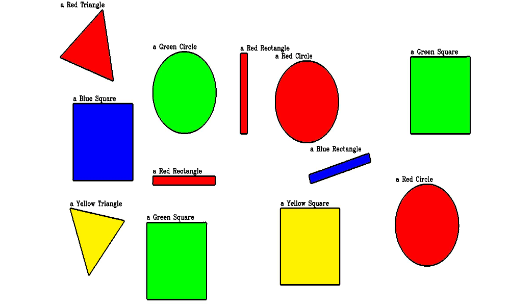

# Shape and Color Detection Project

## Overview
This project is about finding shapes and their colors in pictures.  
Instead of using advanced AI or deep learning, we used simple computer vision methods with **OpenCV** and **NumPy**.  

The program looks at an image, finds the shapes (like circles, squares, and triangles), figures out their main color, and then labels them right on the picture.  

## How It Works
1. The image is turned into grayscale (black and white) to make it easier to work with.  
2. A **binary threshold** is applied so the shapes stand out from the background.  
3. **Contours** (outlines of shapes) are detected using `cv2.findContours`.  
4. The program uses `cv2.approxPolyDP` to figure out the number of sides of each shape.  
5. A mask is created to find the **average BGR color** inside each shape.  
6. The average color is compared with a small set of colors (red, green, blue, yellow, black, white, gray).  
7. The shape and its color are drawn back on the picture with labels.  

---

## Shape Rules
- **Triangle:** 3 sides  
- **Square/Rectangle:** 4 sides → check if width ≈ height to decide  
- **Pentagon:** 5 sides  
- **Circle:** More than 5 sides  

---

## Color Rules
- Take the average color inside the shape.  
- Compare it to the closest predefined color using math (Euclidean distance).  

Colors used:  
- Red, Green, Blue, Yellow, Black, White, Gray  

---

## Tools and Libraries
- **Python 3**  
- **OpenCV (cv2)**  
- **NumPy**  

---

## Challenges
1. **No Deep Learning:**  
   We didn’t use any pretrained AI, so it depends on math and opencv.  

2. **Threshold Sensitivity:**  
   Picking the right threshold value was important; otherwise, the program might miss shapes.  

3. **Color Detection:**  
   Lighting can change the detected color.  

## Example Output
Here’s what the program finds in an image:

